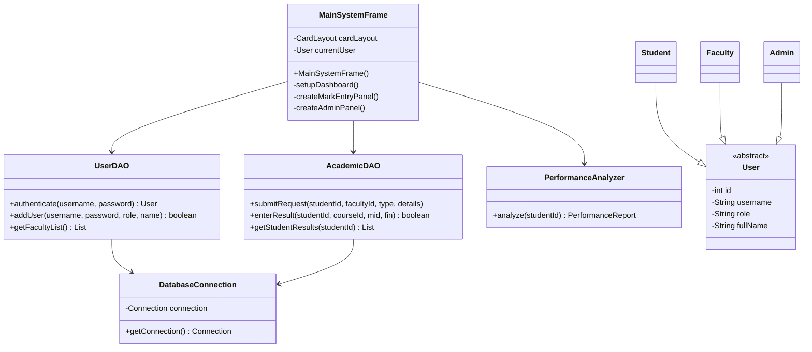

# 🎓 Academic Management System


---

## 🏗️ System Architecture



---

## 🚀 Key Features

* 🔐 **Role-Based Login** — Separate access for Student, Faculty, and Admin.
* 👨‍🎓 **Student Dashboard** — View results, attendance, performance, and submit requests.
* 👨‍🏫 **Faculty Dashboard** — Enter results, manage attendance, and handle student requests.
* 👨‍💼 **Admin Dashboard** — Manage students, faculty, and system users.
* 📊 **Performance Analyzer** — Calculates CGPA, attendance percentage, and academic status.
* ⚠️ **Academic Warning** — Automatically identifies students with attendance below 70%.
* 🗄️ **Database Management** — Academic data is stored and managed using MySQL.
* 🎨 **Modern GUI** — Built with Java Swing and FlatLaf.

---

## 🧠 OOP Concepts

* **Encapsulation** — Private fields with controlled access through methods.
* **Abstraction** — Common user behavior defined through the abstract `User` class.
* **Inheritance** — `Student`, `Faculty`, and `Admin` extend `User`.
* **Polymorphism** — Role-specific behavior through common `User` references.
* **Single Responsibility** — GUI, database, and performance logic are separated into dedicated classes.
* **DAO Pattern** — Database operations are separated from the GUI layer.

---

## 🛠️ Tech Stack

| Technology    | Purpose               |
| ------------- | --------------------- |
| Java SE       | Core Development      |
| Java Swing    | GUI                   |
| FlatLaf       | Look & Feel           |
| MySQL         | Database              |
| JDBC          | Database Connectivity |
| Maven         | Dependency Management |
| IntelliJ IDEA | IDE                   |
| XAMPP         | Local MySQL Server    |

---

## ⚙️ Requirements

* JDK 17+
* IntelliJ IDEA
* XAMPP
* MySQL
* Maven

### Database

```text
Host: localhost

---

## 👨‍💻 Academic Project

**Course:** Object-Oriented Programming (OOP)
**Project Type:** Desktop Application
**Language:** Java
**Database:** MySQL
